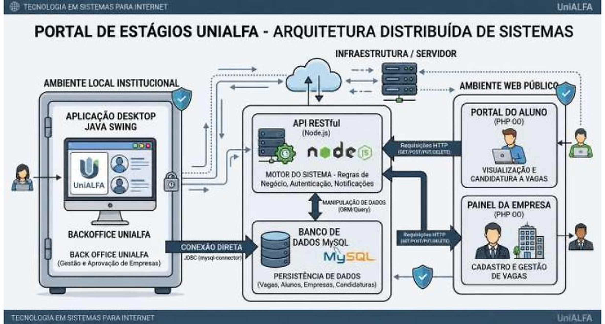
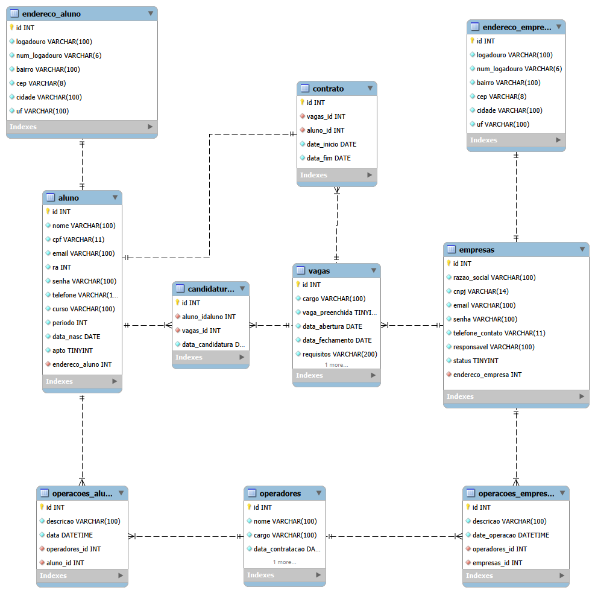

# Tema do HackAthon:

Criar um Portal de estágios, conectando o aluno da Faculdade UniALFA as empresas. O objetivo é apresentar uma plataforma simples e objetiva na qual a "atração principal" - as vagas de estágio - sejam visiveis de forma clara e intuitiva.

# Alunos: 
- Matheus Janoca Castelini: 
    - RA: 250289
- Lucas Mateus Galdino: 
    - RA: 250272
- Pedro Henrique Gonçalvez de Souza:
    - RA: 250275
- Elienay Henrique da Silva Souza:
    - RA : 250283

# Estrutura:

Para montar um ambiente de simulação utilizamos o Docker para separar os ambientes ServerSide e ClientSide em containers. A aplicação desktop em Java foi construída fora do ambiente Docker Compose mas a conexão com o bando de dados MySql é feita apontando para o container do mesmo.

# Tecnologias e Ferramentas

## Web:
### Pagina de alunos
- Um portal aonde o aluno pode fazer as seguintes operações após o login:
    - Candidatar-se a uma vaga em aberto.
    - Acompanhar as candituras.
    - Acompanhar status do contrato caso seja escolhido para vaga.
### Pagina de Empresas
- Um portal para um representante da empresa possa:
    - Cadastrar vagas.
    - Consultar canditatos.
    - Escolher o candidato apto para a vaga.    

## Ambiente local da UniAlfa
### Back Office UniAlfa:
- O operador deve ter as seguintes rotinas:
    - Gerir as empresas: 
        - Aprovar empresas cadastradas.
        - Bloquear ou desativar empresas.
        - Consultar informações cadastrais.
    - Gerir Alunos:
        - Cadastrar, editar, e consultar alunos.
        - Importar alunos matriculados através de arquivos de texto.
        - Controlar quais alunos estão aptos a participar dos processos de estágio.
    - Gestão de vagas:
        - Consultar vagas cadastradas.
        - Consultar candidaturas realizadas pelos alunos.
        - Vizualizar status das candidaturas.
        - Gerar relatórios gerenciais relacionados às vagas e candidaturas.
    - Exportar relatórios em arquivos de texto:
        - Empresas cadastradas.
        - Alunos cadastrados.
        - Vagas disponiveis.
        - Candidaturas realizadas e seus respectivos status.         

## Estrutura do Banco de Dados em MySQL

## Estrutura em Docker Compose.
Para simular os ambientes de banco de dados, API REST e páginas web para acesso de alunos e empresas utilizamos containers para cada uma das aplicações.

- Container de node:
    - O container de Node.js é construído com as bibliotecas instanciadas no package.json para operações GET, POST, PUT e DELETE no container de MySQL.
- Container de PHP Apache:
    - Container criado para operações de front-end, como rederizar páginas html, enviar requisições para a API construida dentro do container de Node.js
- Container de MySQL:
    - Container do banco em MySQL, todas as informações são guardadas no volume nomeado no final do arquivo docker-compose.yml
- Container de PHP myadmin:
    - Container resposavel pela visualização web do banco de dados durante o desenvolvimento do sistema.

# Estrutura de pastas:
## Estrutura de pasta na aplicação do BackOffice:

    hackathon-java/
    ┣ docs/
    ┗ src/
    ┗ main/
        ┗ java/
        ┗ userHackathon/
            ┣ dao/
            ┣ gui/
            ┣ model/
            ┣ service/
            ┗ util/

## Estrutura de pastas na estrutura da API em Node.JS:

    hackathon-node-api/
    ┗ src/
    ┣ controllers/
    ┣ database/
    ┃ ┣ migrations/
    ┃ ┗ seeds/
    ┣ middlewares/
    ┣ models/
    ┣ repositories/
    ┣ routes/
    ┣ services/
    ┗ utils/

## Estrutura de pastas na estrutura das páginas Web:

    hackathon-php-web/
    ┣ classes/
    ┣ css/
    ┣ img/
    ┗ js/

# Modus operante de desenvolvimento

## Repositório remoto original:
- Este repositório tem duas branchs (main e dev), as atualizações devem ser enviadas via pull request na branch dev. Após revisão, será feito o merge para a branch main e estará disponivel para as forks dos demais alunos sincronizarem. 

# Como utilizar local

1. Crie uma fork deste repositório em sua conta do GitHub.

2. Clone o repositório para seu ambiente local usando:
 git clone https://github.com/MatrCastelini23/hackathon.git

3. Crie um arquivo .env, e cole as variaveis de banco de dados dentro. Siga o .env.exemple

4. Após o clone rode o comando docker compose up --build para construir os containers.
    - Veja se dentro dos containers estão operando

5. Acesse a pagina web no enderço localhost:80, o phpmyadmin para visualizar o banco no endereço localhost:8080. 

6. Rode o npm run seed:run para povoar o banco dentro do container de node.js